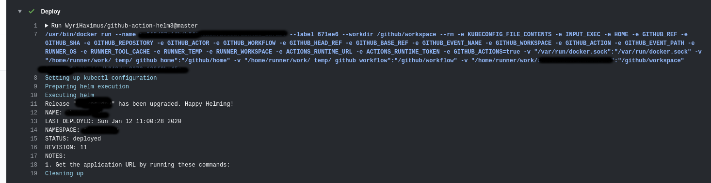

# Helm Github Action

Runs given Helm/shell commands after ensuring Helm and kubectl are installed or pull in it's own. 



## Options

This action supports the following options.

### exec

The shell commands to run.

* *Required*: `Yes`
* *Type*: `string`
* *Example*: `helm version`

## kubeconfig

The contents of the `~/.kube/config` used by kubectl and helm to authenticate and communicate with your kubernetes
cluster. *Note: this can be empty if you want to use this action to do helm lints. The contents of this input will
be appended to `~/.kube/config`, and will always be removed afterwards.*

* *Required*: `no`
* *Type*: `string`

## Output

This action has only one output and that's the `number` output. This is the number you see in the HTML URL of the
milestone and can be used to refer to in other actions when creating PR's as shown in the example below.

## Examples

The following example is triggered on the tagging of a new release and update the helm charts `appVersion` to the tag
title before calling helm to install the application in `./.helm/app/` to kubernetes:

```yaml
name: Deploy
on:
  release:
    types: [created]
jobs:
  deployment:
    runs-on: 'ubuntu-latest'
    steps:
      - uses: actions/checkout@v3
      - name: Deploy
        uses: WyriHaximus/github-action-helm3@v3
        with:
          exec: helm upgrade APP_NAME ./.helm/app/ --install --wait --atomic --namespace=APP_NAMESPACE --values=./.helm/app/values.yaml
          kubeconfig: '${{ secrets.KUBECONFIG }}'
```

The following example shows how you can use this action to lint your helm files in (for example) `./.helm/app/`.

```yaml
name: CI
on:
  push:
jobs:
  lint-helm:
    runs-on: ubuntu-latest
    steps:
      - uses: actions/checkout@v3
      - name: Lint Helm
        uses: WyriHaximus/github-action-helm3@v3
        with:
          exec: helm lint ./.helm/app/
```

## License ##

Copyright 2023 [Cees-Jan Kiewiet](http://wyrihaximus.net/)

Permission is hereby granted, free of charge, to any person
obtaining a copy of this software and associated documentation
files (the "Software"), to deal in the Software without
restriction, including without limitation the rights to use,
copy, modify, merge, publish, distribute, sublicense, and/or sell
copies of the Software, and to permit persons to whom the
Software is furnished to do so, subject to the following
conditions:

The above copyright notice and this permission notice shall be
included in all copies or substantial portions of the Software.

THE SOFTWARE IS PROVIDED "AS IS", WITHOUT WARRANTY OF ANY KIND,
EXPRESS OR IMPLIED, INCLUDING BUT NOT LIMITED TO THE WARRANTIES
OF MERCHANTABILITY, FITNESS FOR A PARTICULAR PURPOSE AND
NONINFRINGEMENT. IN NO EVENT SHALL THE AUTHORS OR COPYRIGHT
HOLDERS BE LIABLE FOR ANY CLAIM, DAMAGES OR OTHER LIABILITY,
WHETHER IN AN ACTION OF CONTRACT, TORT OR OTHERWISE, ARISING
FROM, OUT OF OR IN CONNECTION WITH THE SOFTWARE OR THE USE OR
OTHER DEALINGS IN THE SOFTWARE.
